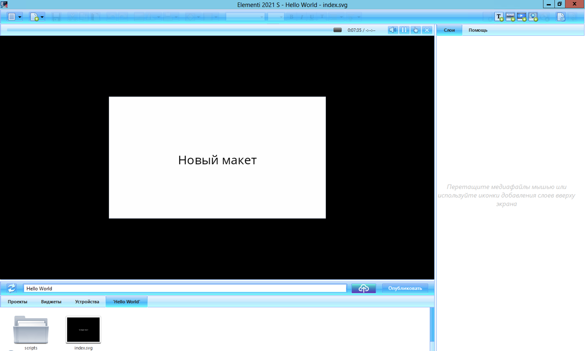
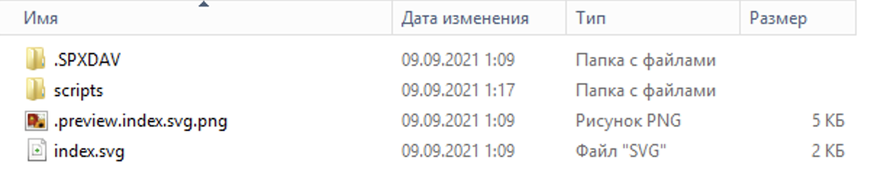
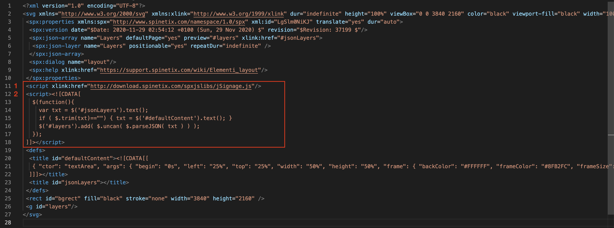
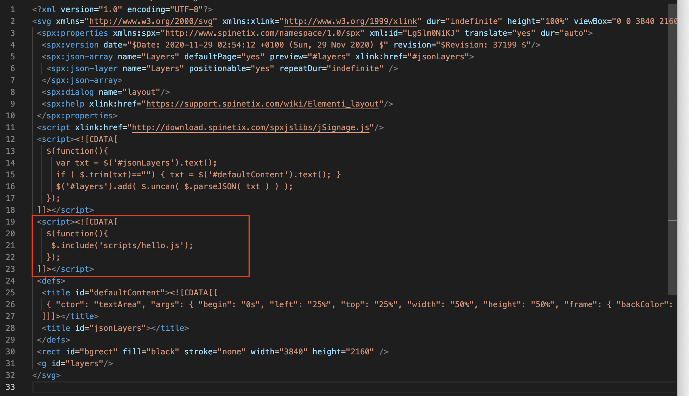
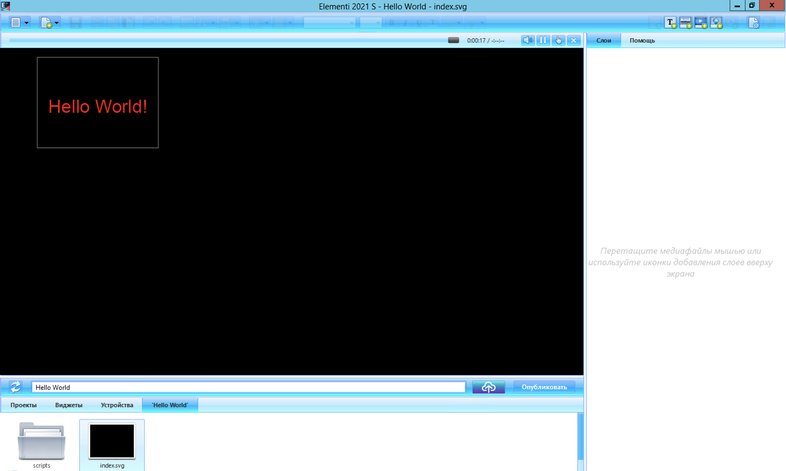
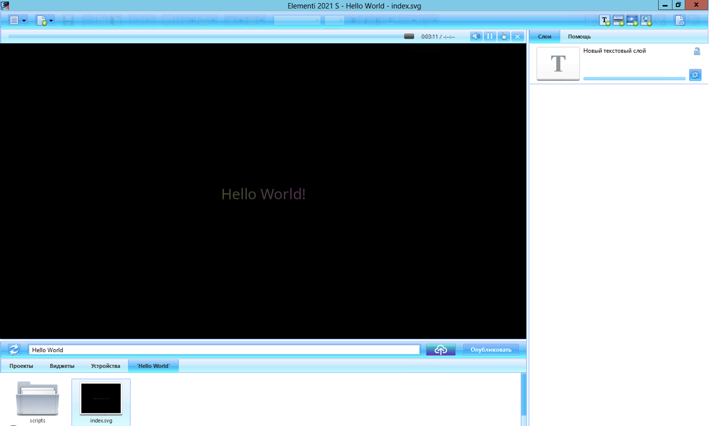

# Введение в программирование для плееров SpinetiX

У плееров **SpinetiX** есть одна очень привлекательная и крутая черта, которая незаслуженно остается в тени. Речь идет о возможности использования **JavaScript** при создании контента. Причем при помощи **JavaScript** благодаря архитектуре плееров можно делать много чего: импортировать данные из других систем, управлять медиа-контентом, создавать на лету элементы, менять их свойства и многое другое.

Плееры **SpinetiX** поддерживают стандарт **ECMAScript 5** (начиная с версии прошивки 3.0.0) - не самый современный, конечно, но и не очень старый. Жить можно. 

Поддерживается ограниченное число библиотек и API - полноценные современные веб-приложения не сделаешь, но их достаточно, для большинства задача, на которые рассчитан плеер. 

Основная библиотека, которая есть в каждом проекте - это **jSignage**, включающая функции из **jQuery** (библиотека портирована для SpinetiX OS). Кроме того, можно использовать также ограниченный набор модулей из **Node API**: **buffer**, **events**, **net**, **stream** и **dgram**.

Полный список возможностей JS можно посмотреть [тут](!https://support.spinetix.com/wiki/JavaScript).

## Что потребуется для работы?

- Плеер **SpinetiX** **HMP400** (можно и более ранние модели, но они уже снимаются с производства)
- Программа **Elementi** (вообще говоря, для создания больших проектов очень желательно версия **X**, которая включает встроенные средства отладки, но для начала можно обойтись и **S** - ее вполне достаточно для освоения и создания первых проектов)
- Текстовый редактор для редактирования .js файлов
- Знание **JavaScript** и умение работать в графической оболочке **Elementi** для создания контента.

## Создаем Hello World!

Не бурем нарушать традицию и создадим проект, который выводит текст **Hello World**. Это позволит понять базовые принципы, как добавлять скрипты в проект и работать с ними.

Не смотря на достаточно большие возможности по программированию, процесс добавления скриптов далеко не очевиден. **Elementi** не предлагает функций управления скриптами через GUI и добавлять скрипты в проект придется вручную. Хорошая новость, что делать это нужно будет только раз при добавлении нового скрипта. 

Поехали.

Заходим в **Elementi** и создаем проект _Hello World_ и сразу создадим в проекте папку **scripts**, в которой у нас будут храниться скрипты.



В каждом проекте у нас есть **index.svg**, в которым хранится вся структура нашего проекта - описание всех элементов и их атрибутов. В этот же файл мы будем добавлять информацию об используемых скриптах.

В терминах **SpinetiX** проект - это папка и мы можем посмотреть ее содержание, используя _Проводник_.


Мы видим тут созданную пустую папку **scripts** и файл **index.svg**. Так как svg - это текстовые файлы, мы можем открыть его в текстовом редакторе. Мы видим структуру, из которой нас интересует только блок загрузки скриптов:


Скрипт 1: это загрузка основной библиотеки **jSignage**.  
Скрипт 2: начальная инициализация слоев.  

Тут стоит сказать пару слов о конструкции:
```js
  $(function(){
    // ...
  });
```

Она эквивалентна:
```js
  $('svg').ready(function(){
    // ...
  });
```
Так становится все гораздо понятнее: `$('svg')` - получение корневого элемента структуры проекта, а `.ready()` вызывает наш callback, когда завершается строительство **DOM**.

Если не использовать эту обертку, то к моменту вызова нашего скрипта **DOM**-структура будет еще неготова и мы не сможем с ней производить никакие операции. Иногда это не нужно, например, если скрипт делает внутреннюю инициализацию или обращается за внешними данными и не обращается к **DOM**.


Итак, добавлять скрипты можно тремя способами, два из которых мы уже видели:
- Используя **xlink:href** (можно загружать внешние и локальные скрипты). Так, например, загружается скрипт 1 в привере выше.
- Используя inline-скрипты в svg. Мы видим это примере 2.
- Используя функцию **.include** в inline-скрипте

Второй способ добавления скриптов хотя и абсолютно законен, но крайне неудобен с точки зрения создания и поддержки кода, поэтому его мы в дальнейшем рассматривать не будем. Первый и третий вариант - это как раз то, что нам нужно. 

Обращаю внимания, что в первом случае, скрипт не имеет обертки и поэтому в момент запуска скрипта мы не можем использовать обращения к **DOM**, но ничто нам не запрещает сделать обертку с **.ready** непосредственно в нашем скрипте - об этом речь пойдет ниже.

При использовании **.include** в inline-скрипте мы можем сразу обернуть его вызов и дождаться окончания строительства **DOM**. Это упрощает нам жизнь, поэтому в первом примере мы будем использовать **.include**.

В папке **scripts** создаем файл **hello.js**:
```js
alert('Hello World');
```

Далее открываем в текстовом редакторе **index.svg** и добавляем импорт нашего файла внутри callback'а:

```xml
 <script><![CDATA[
   $(function(){
    $.include('scripts/hello.js');
   });
 ]]></script>
```

 В результате должно получиться так:
 

 Теперь, если мы перезагрузим проект в **Elementi** (двойное нажатие мышкой на **index.svg**), у нас откроется сообщение _Hello World_ - наш скрипт загружается и запускается. Первая версия нашей программы готова.

**ВАЖНОЕ ЗАМЕЧАНИЕ:** Мы добавили загрузку нашего скрипта непосредственно в **index.svg**. А что будет, если мы будем редактировать проект в **Elementi**? Если мы добавим элемент в GUI, то  **index.svg** будет перезаписан. Что будет с нашим добавленным скриптом? Хорошая новость - все что мы добавляем как скрипты будет сохраняться в проекте. Поэтому, добавив скрипт один раз, нам больше не нужно ничего делать. В тоже время сам скрипт мы можем редактировать. 

## Hello World с созданием слоя налету.

В предыдущем примере мы научились загружать скрипты. Теперь давайте добавим отображение надписи _Hello World!_ рендером плеера, а не функцией **alert**. Для этого мы модифицируем наш **hello.js**:
```js
$('svg').add($.textArea({
  left: 240,
  top: 60,
  width: 800,
  height: 600,
  frame: { frameColor: 'white', frameSize: 2 },
  fill: '#ff0000',
  fontSize: 120
}).text( 'Hello World!' ));
```

Если мы все сделали правильно, то у нас получится:
 

Мы на лету создали текстовый элемент и вывели его на экран.

## Hello World - меняем текст в элементе.

Иногда удобнее не создавать элементы налету, а менять свойства существующих элементов. Например, это удобнее потому что мы можем разместить элемент в нужном месте и задать его свойства в редакторе, а не указывать их при создании.

Заодно давайте посмотрим в чем разница с загрузкой скрипта с использованием **xlink:href**.

Удаляем строчки из **index.svg**:

```xml
 <script><![CDATA[
   $(function(){
    $.include('scripts/hello.js');
   });
 ]]></script>
```

И добавляем:
```xml
  <script xlink:href="scripts/hello.js"/>
```

Замечаем, что наш пример продолжает работать. Добавляем новый текстовый слой в GUI - мы хотим изменить его текст в нашем коде. Задаем расположение и свойства, потом идем в раздел свойств **Расширенные** и меняем там **id** на **hello** (можем этого и не делать, но удобнее работать с понятным id).

Меняем наш **hello.js**:
```js
$('#hello').text('Hello World!');
```

Здесь `$('#hello')` возвращает нам наш элемент, а `text('Hello World!')` меняет значение текста. 

Запускаем проект и... ничего не происходит. Как я уже говорил раньше, при использовании метода загрузки через **xlink:href**, структура **DOM** не готова в момент запуска скрипта и поэтому у нас ничего не вышло.

Модифицируем наш **hello.js**:
```js
$(function(){
  $('#hello').ready(function(){
    $('#hello').text('Hello World!');
  });
});
```

Тут, мы обернули вызов нашей инициализации в сразу два callback'а - первый дожидается, когда будет готова структура 'svg'. А второй дожидается, когда в нее будет добавлен наш элемент **hello** (для адресации по id элемента мы используем символ **#**).

Мы можем упростить наш код до:
```js
  $(function(){
    $('#hello').text('Hello World!');
  });
```
Но для этого нам нужно переместить вызов нашего скрипта после скрипта инициализации 2 - скрипты вызываются последовательно и callback'и будут вызываться в той же очередности.

Запускаем проект, и все работает:
 

## Вместо заключения

Когда мы разобрались, как добавлять скрипты и понимаем базовые принципы, то можем начинать экспериментировать и создавать классные решения - **JavaScript** дает колоссальную гибкость и открывает много возможностей.

## Полезные ссылки:
- [Введение про jSignage](https://support.spinetix.com/wiki/JSignage)
- [jSignage tutorials](https://support.spinetix.com/wiki/JSignage_tutorials)
- [jSignage API](https://support.spinetix.com/wiki/JSignage_API)

## Контакты
Александр Пивоваров, pivovarov@gmail.com
